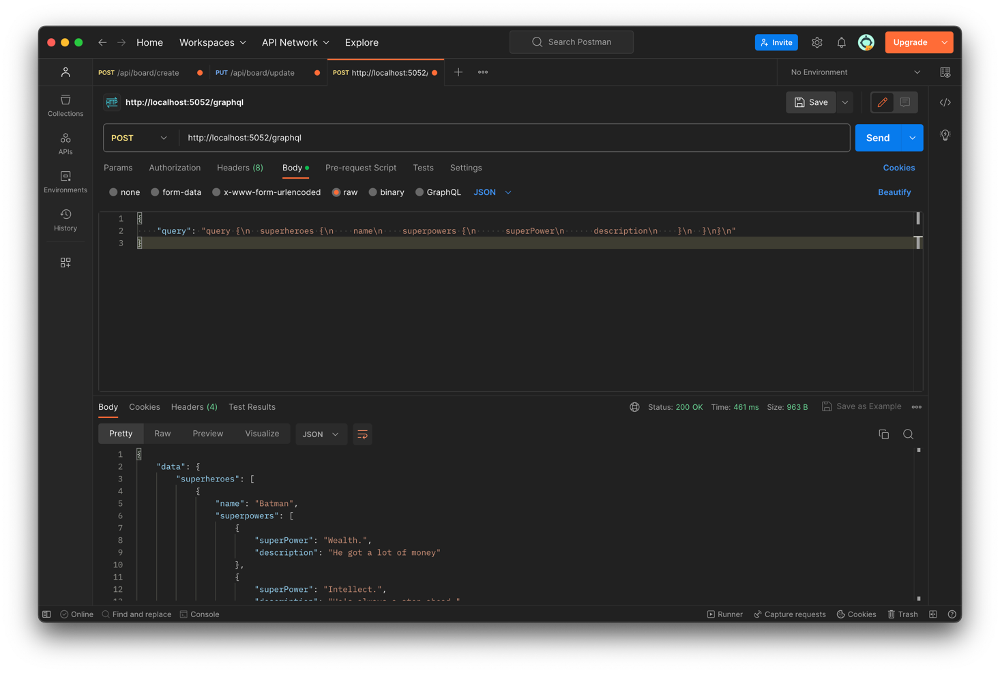
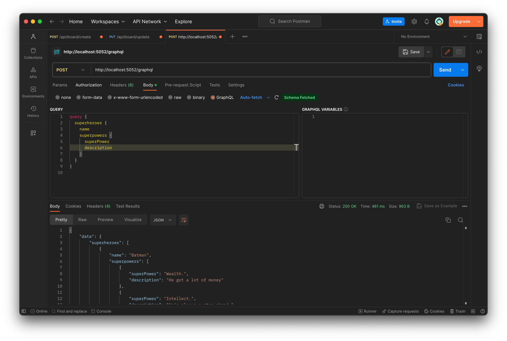

## Executing

Use `dotnet run` to run the app.

## Demonstation

Sending POST request using JSON:


Sending POST request using GraphQL:


## Packages used

```
<PackageReference Include="GraphQL.Server.Transports.AspNetCore" Version="7.5.0" />
<PackageReference Include="HotChocolate.AspNetCore" Version="13.4.0" />
<PackageReference Include="HotChocolate.Data.EntityFramework" Version="13.4.0" />
<PackageReference Include="Microsoft.AspNetCore.OpenApi" Version="7.0.5" />
<PackageReference Include="Microsoft.EntityFrameworkCore" Version="7.0.9" />
<PackageReference Include="Microsoft.EntityFrameworkCore.Design" Version="7.0.9">
  <PrivateAssets>all</PrivateAssets>
  <IncludeAssets>runtime; build; native; contentfiles; analyzers; buildtransitive</IncludeAssets>
</PackageReference>
<PackageReference Include="Microsoft.EntityFrameworkCore.Sqlite" Version="7.0.9" />
<PackageReference Include="Swashbuckle.AspNetCore" Version="6.4.0" />
```